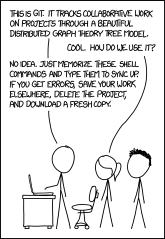

# A brief introduction to git and github

{height=40%}

## Files

- [Setup](setup/README.md)
- [Introduction](intro/README.md)
- [Practical](practical/README.md)
- [Handle merge-conflicts practical](merge-conflicts/README.md)
- [Example files](examples/README.md)
- [Docs](doc/README.md)

## License and copyright

MIT [License](LICENSE)
