# GIT = GITHUB?


\Large
- [**git**](https://git-scm.com/) - is a version control software
- [**github**](https://github.com) - is an online repository ([github.com](https://github.com))

---

# Are you in control (of your versions)?

\centering
{height=90%}

---

# Version control system - Benefits

\Large
- Good for text and files that potentially change over time

. . .

- Great for managing going back and forth between versions of such documents

. . .

- Excellent for managing such files when shared by many people

. . .

- Super for **ensuring reproducible research**

---

# Version control system - Challenges

\Large
- Learning phase: New concepts and computer interactions

---

# Version control system - Challenges

\Large
- Perhaps unintuitive way of interacting with changes?

---

# Version control system - Challenges

\centering
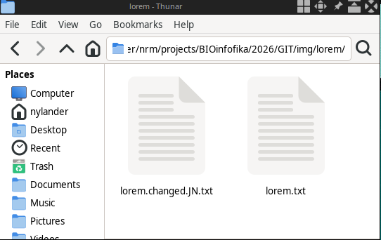{width=60%}

---

# Version control system - Challenges

\centering
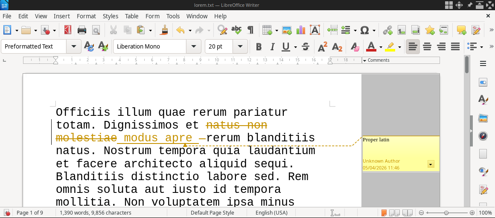{width=70%}

---

# Version control system - Challenges

\centering
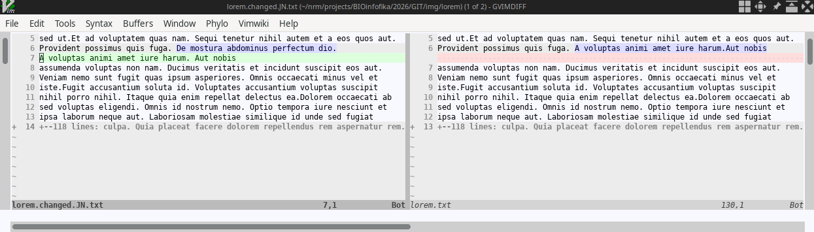{width=90%}

---

# Version control system - git

\centering
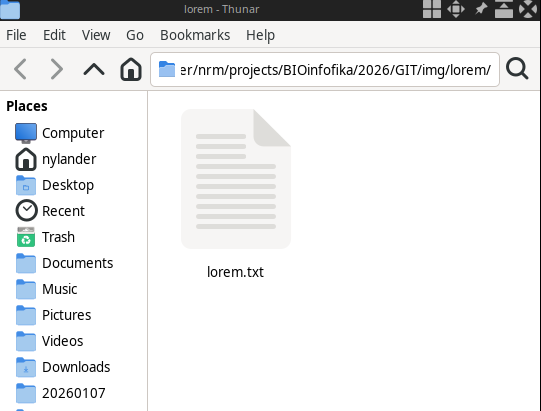{width=60%}

---

# Version control system - git

\centering
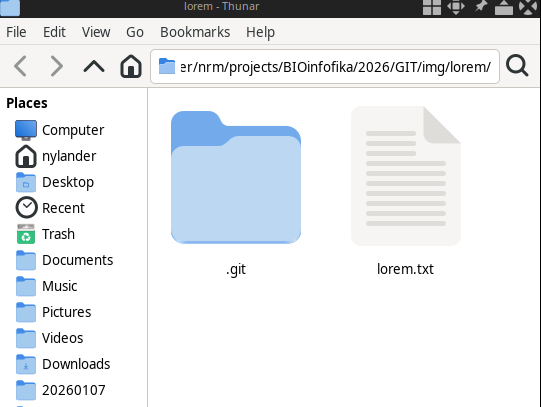{width=60%}

---

# Version control system - git

\centering
{width=90%}

---

# Collaborative work using GitHub.com

\centering
{height=80%}

---

# Collaborative work using GitHub.com

\centering
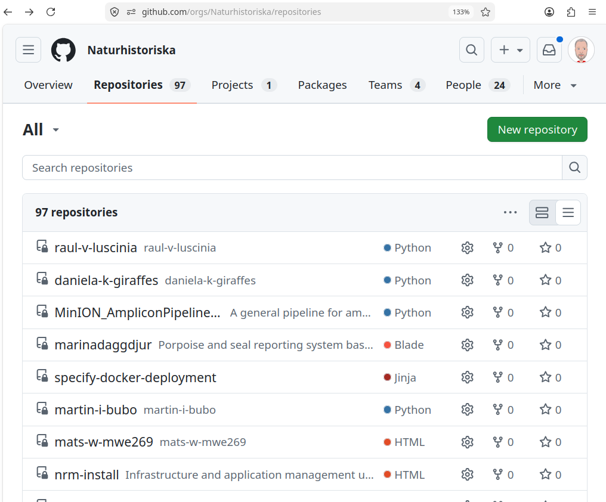{height=80%}

---

# Collaborative work using GitHub.com

\centering
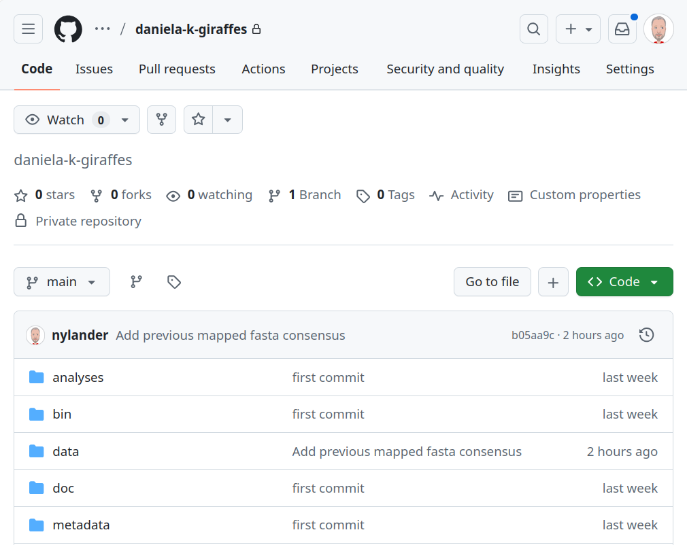{height=80%}

---

# Keep one "main" repository on GitHub

\centering
{width=90%}

---

# Download repository from github.com

\centering
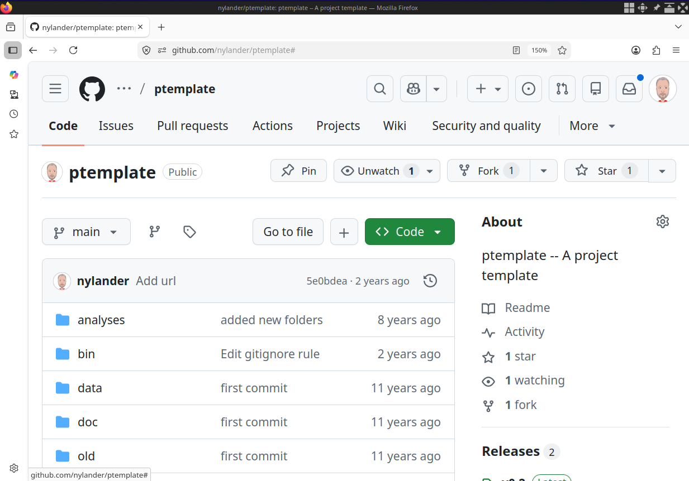{height=80%}

---

# Download repository from github.com

\centering
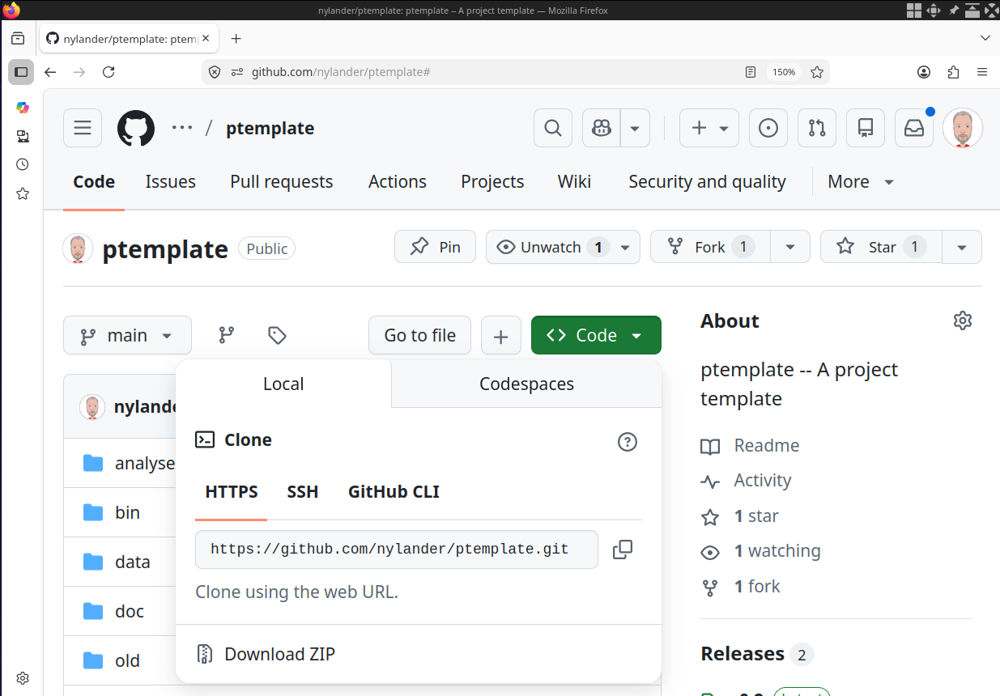{height=80%}

---

# Download ("clone") repository from github.com using git

\centering
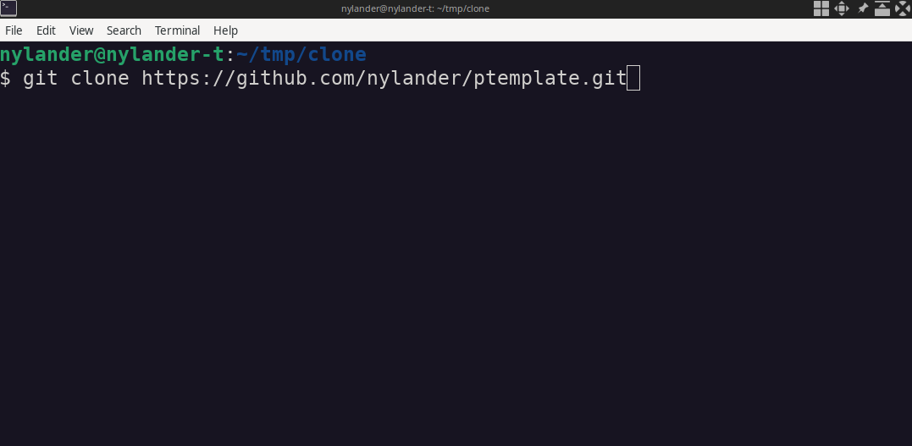

---

# Download ("clone") repository from github.com using git

\centering
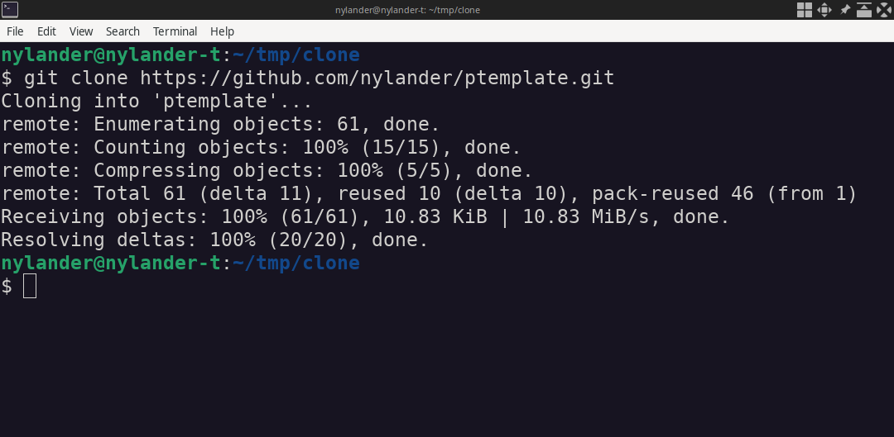

---

# Download ("clone") repository from github.com using git

\centering
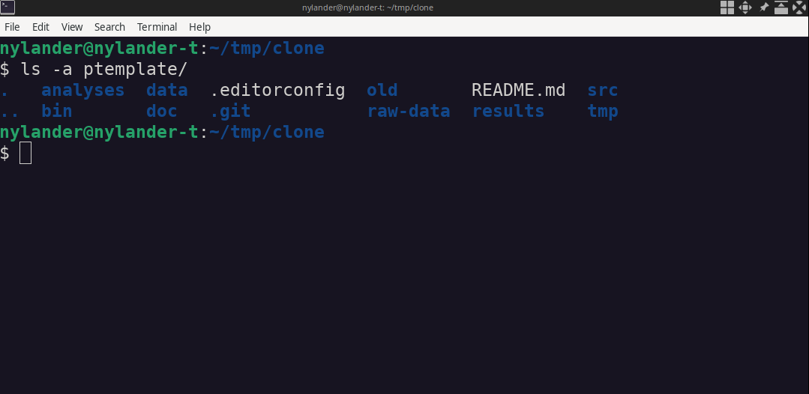

---

# Make changes to files in your local repository (1: add)

\Large
For example, create a new file `apa.txt`, then **add** it to the collection of
files to be kept under version control!

&nbsp;

```bash
$ git add apa.txt

```

---

# Make changes to files in your local repository (2: commit)

\Large
Now **commit** to the changes you made

&nbsp;

```bash
$ git commit -m "Mandatory message with description"

```

---

# Make changes to files in your local repository (3: push)

\Large
Finally, **push** the changes you made to github

&nbsp;

```bash
$ git push

```

---

# Commit history (blame)

\centering
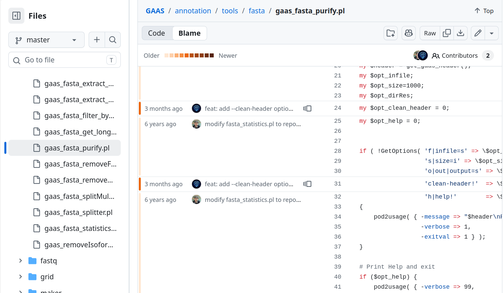{height=80%}

---

# Commit history (blame)

\centering
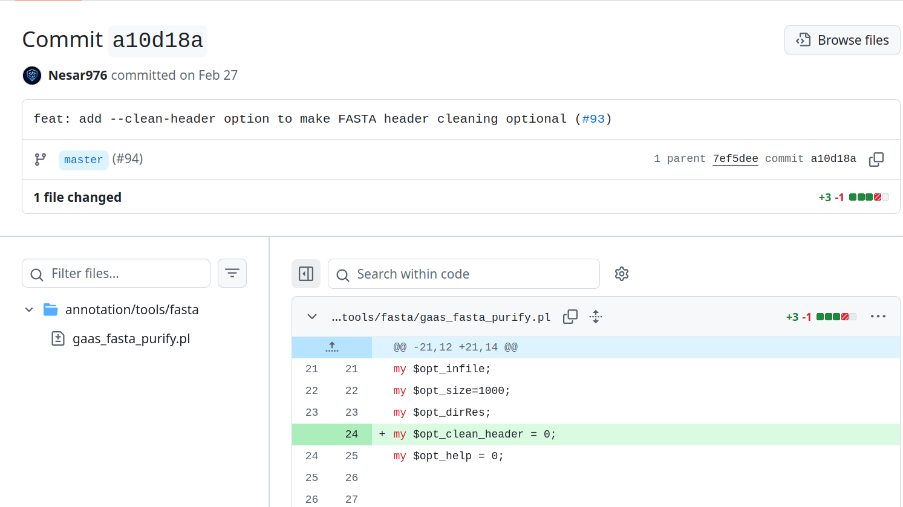{height=80%}

---

# Commit history (log)

\centering
{height=80%}

---

# Commit history (log)

\centering
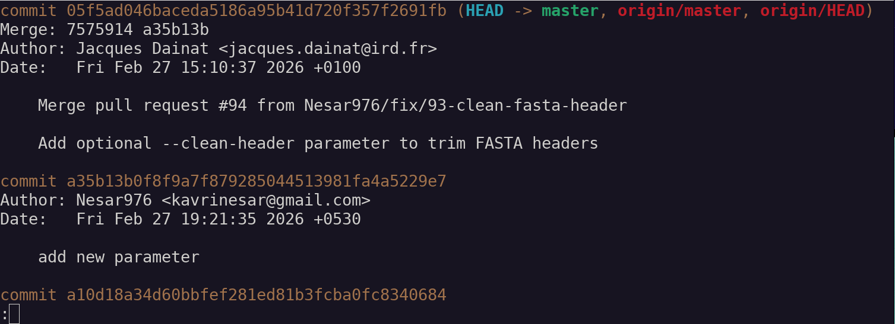{height=80%}

---

# Commit history (log)

\centering
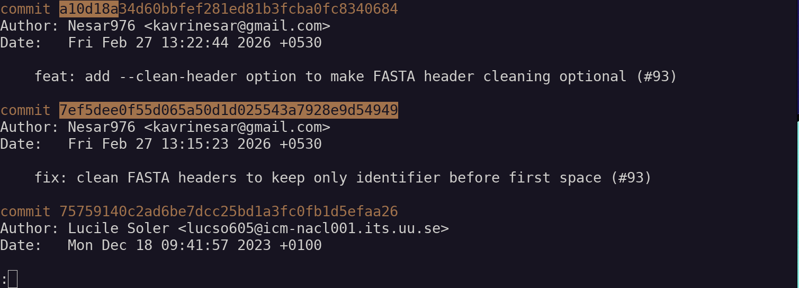{height=80%}

---

# Undo[^1]

\centering
{height=80%}

[^1]: There are many ways of "undoing" edits!

---

# True power comes with "branches"

\centering
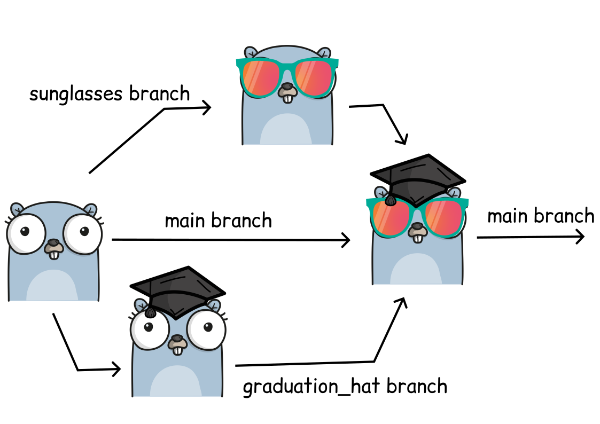

---

# Typical collaborative workflow with branches and github

\centering


---

# You don't have to type commands...[^2]

\centering
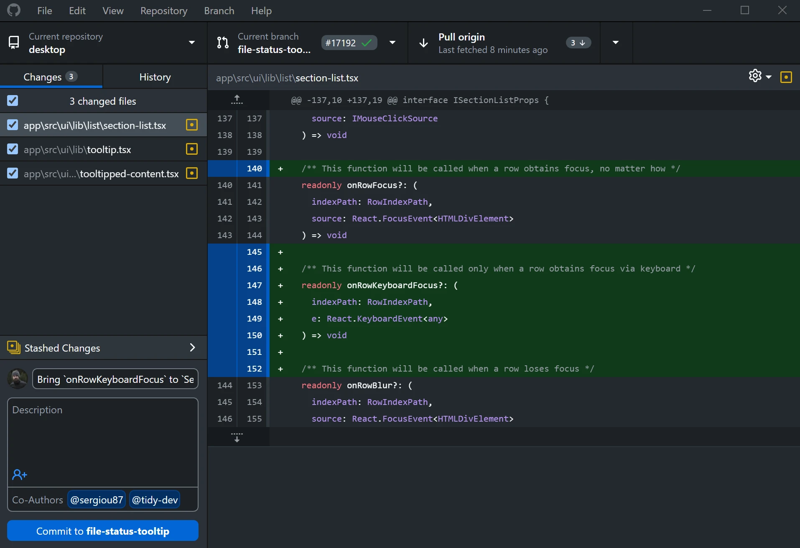{height=80%}

[^2]: [GitHub Desktop](https://github.com/apps/desktop)

---

# You don't have to type commands...[^3]

\centering


[^3]: [Visual Studio Code](https://code.visualstudio.com/)

---

# You don't have to type commands...

\centering
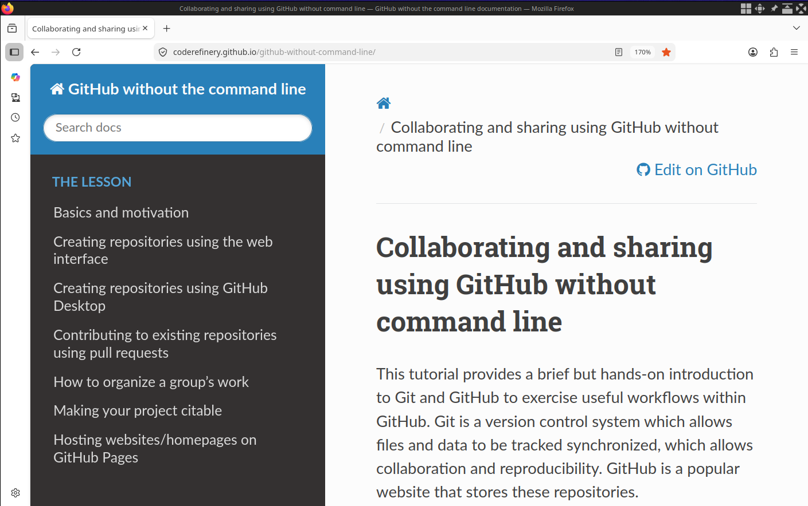{height=70%}

&nbsp;

[https://coderefinery.github.io/github-without-command-line](https://coderefinery.github.io/github-without-command-line/)

