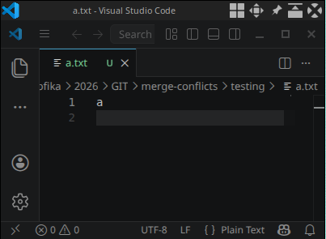
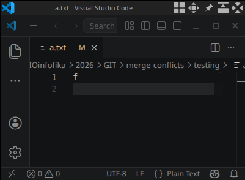
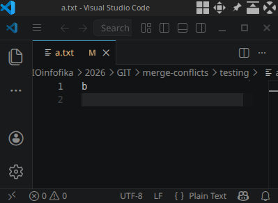
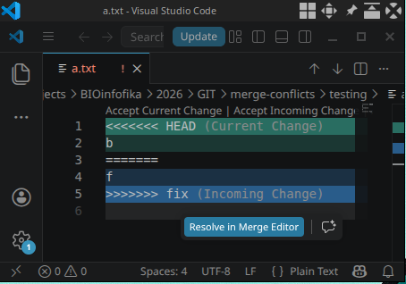
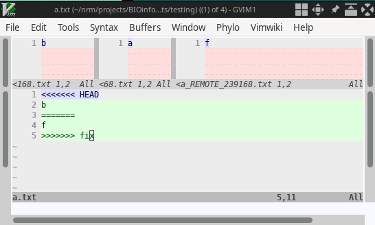

# Examples for handling *simple* merge conflicts

- Last modified: 2026-05-06 13:10:56
- Sign: Johan Nylander

## Exercise (local)

Create a repository with some content tracked by git

    $ mkdir -p testing && cd testing
    $ git init
    $ echo "a" > a.txt
    $ cat a.txt
    a

{width=40%}

    $ git add a.txt
    $ git commit -m "first commit"

---

Switch to a new branch and make some edits

    $ git checkout -b fix
    $ sed -i 's/a/f/' a.txt
    $ cat a.txt
    f

{width=40%}

    $ git add a.txt
    $ git commit -m "my fix"

---

Go back to main, make a change

    $ git checkout main
    $ cat a.txt
    a

    $ sed -i 's/a/b/' a.txt
    $ cat a.txt
    b

{width=40%}

    $ git add a.txt
    $ git commit -m "make a change on main"

---

Checkout a "test merge" branch and try a `merge`. This will give a hint on
the work ahead without touching the `main` branch.

    $ git checkout -b testmerge
    $ cat a.txt
    b

    $ git merge fix
    Auto-merging a.txt
    CONFLICT (content): Merge conflict in a.txt
    Automatic merge failed; fix conflicts and then commit the result.

    $ cat a.txt
    <<<<<<< HEAD
    b
    =======
    f
    >>>>>>> fix

### Alt. 1 - Resolve the conflict while staying on the `testmerge` branch

If we see a conflict, we can either work on the `testmerge` branch, or go back
to `main` and work from there. Here we will work on the `testmerge` branch.
This approach will, however, introduce a new concept in the end
(["rebasing"](https://git-scm.com/docs/git-rebase)).

Look at the file containing the conflict

{width=50%}

All content between the `<<<<<<< HEAD` and the center line (`=======`) is
content that exists in the current branch `testmerge` (which the HEAD ref is
pointing to). Similarly, all content between the center and `>>>>>>> fix` is
content that is present in our merging branch (`fix`).

To resolve, we need to decide which edit (i.e. commit) we want to keep, edit
the file, then `add` and `commit` (see also the [Tip](#tip) below).

---

Assume that we want to keep the content from our branch `fix`

    $ nano a.txt
    # edit

{width=40%}

    $ cat a.txt
    f

    $ git add a.txt
    $ git commit -m "fix merge conflict"

---

We have now fixed the conflicting file on the `testmerge` branch, but we still
have another version of `a.txt` on the `main` branch.  However, since the only
difference between `main` and `testmerge` is our corrected `a.txt` (on
`testmerge`), we can take those corrections and put at the top of our `main`
branch (i.e.
["rebasing"](https://blog.stackademic.com/git-rebase-explained-like-youre-new-to-git-263c19fa86ec)).

    $ git checkout main
    $ cat a.txt
    b

---

Do a `rebase` to transfer the only (non-conflicting) change we have done from
`testmerge` to `main`:

    $ git rebase testmerge
    $ cat a.txt
    f

---

Remove our `testmerge` and `fix` branches

    $ git branch
      fix
      * main
      testmerge

    $ git branch -d testmerge fix

### Alt. 2 - work on the `main` branch

*Warning*: Staying on the `main` branch while fixing conflicts may be dangerous. You
may potentially run in to more problems, and having to revert to a previous
version of the branch may not be trivial. Anyhow, the procedure to fix affected files are
same as before, and you end by committing directly to `main`.

## Tip

A great method for resolving a merge conflict is to compare the different
alternatives side by side. Many editors have advanced capacity to visualize
those differences -- and even provide AI-guided help to resolve merge
conflicts! Take a look at, for example, [VS
code](https://code.visualstudio.com/docs/copilot/copilot-smart-actions#_resolve-merge-conflicts-with-ai-experimental).
Git has a build-in feature that can be useful:
[mergetool](https://git-scm.com/docs/git-mergetool). One example (standing in
the git repository where you have a conflict) is to use

    $ git mergetool

{width=65%}

## See also

- <https://git-scm.com/docs/git-merge>
- <https://git-scm.com/docs/git-rebase>
- <https://git-scm.com/docs/git-reset>
- <https://git-scm.com/docs/git-diff>
- <https://git-scm.com/docs/git-stash>
- <https://blog.stackademic.com/git-rebase-explained-like-youre-new-to-git-263c19fa86ec>
- <https://code.visualstudio.com/docs/copilot/copilot-smart-actions#_resolve-merge-conflicts-with-ai-experimental>

## Code to quickly create a repo with a merge conflict

\footnotesize
```bash
reponame='repo-with-merge-conflict'
if [ ! -d $reponame ] ; then
  mkdir "$reponame"
else
  echo "Folder $reponame exists. Will not overwrite"
  exit 1
fi
pushd "$reponame"
git init
echo "a" > a.txt
git add a.txt
git commit -m "first commit"
git checkout -b fix
sed -i 's/a/f/' a.txt
git add a.txt
git commit -m "my fix"
git checkout main
sed -i 's/a/b/' a.txt
git add a.txt
git commit -m "make a change on main"
git checkout -b testmerge
git merge fix
```
