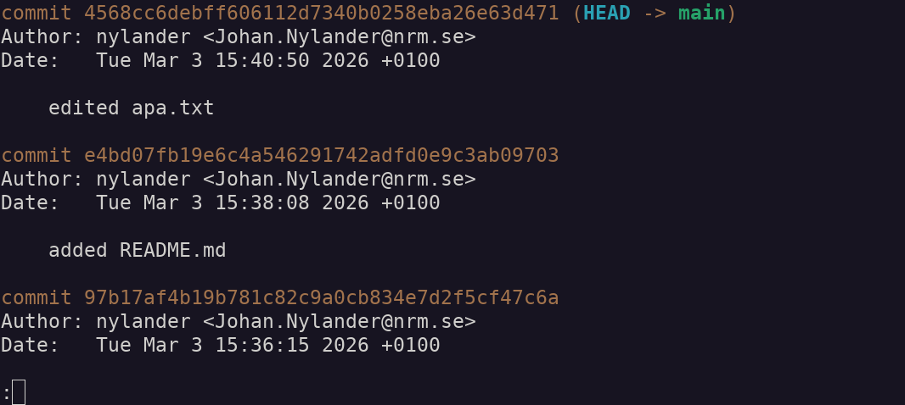

# git topics to cover (including creating repos on github)

- [ ] Clone
- [ ] Initialize
- [ ] Add
- [ ] Commit
- [ ] Push
- [ ] Fetch
- [ ] Pull
- [ ] Branch
- [ ] Merge
- [ ] Restore

---

# Setup 1. Clone repository with this presentation and other material from github.com

\large
```
$ git clone https://github.com/Naturhistoriska/git-github-intro.git
```

---

# Setup 2. Locate the files in git-github-intro/examples/download

- **Copy the file** `myproj.zip` **to somewhere outside of git-github-intro, and extract it**

&nbsp;

(You should have a folder "`myproj`" with subfolders)

---

# Setup 2: Folder structure

```
$ cd myproj
$ tree
```

&nbsp;


---

# git workflow (practical starts here)

```
$ git init
```

&nbsp;


---

# git workflow

```
$ ls -la
```

&nbsp;


---

# git workflow

```
$ ls .git
```

&nbsp;


---

# git workflow

```
$ git status
```

&nbsp;


---

# git workflow

```
$ git add apa.txt dir/
```

---

# git workflow

```
$ git status
```

&nbsp;


---

# git workflow

```
$ git commit -m "first commit"
```

&nbsp;


---

# git workflow

```
$ git status
```

&nbsp;


---

# git workflow

Add a [README.md file](../examples/download/README.md) in [markdown
format](https://docs.github.com/en/get-started/writing-on-github/getting-started-with-writing-and-formatting-on-github/basic-writing-and-formatting-syntax)
to your project

&nbsp;

```txt
# README for myproj

- 2018-04-01
- Joe.Bro@flo.co

## Description

Some description
```

---

# git workflow

```
$ git status
```

&nbsp;


---

# git workflow

```
$ git add README.md
$ git commit -m "added README.md"
```

---

# git workflow

**Edit some file**

&nbsp;

```
$ echo "apa" >> apa.txt
```

---

# git workflow

```
$ git status
```

&nbsp;


---

# git workflow

```
$ git add apa.txt
$ git commit -m "edited apa.txt"
```

---

# git workflow - Summary

```
$ git init
$ git add <files-and-folders>
$ git commit -m "message"
```

---

# Create a `myproj` repository on github

- Open your private github page (`https://github.com/your-user-name`)

- Click on the "`plus sign -> Create new... -> New repository`" (upper right-hand corner)

- Add "`myproj`" as Repository name

- Add a brief Description

- Choose visiblity "`Private`"

- Click on green button `Create repository`

---

# Add your local repository to github

```
$ cd myproj
$ git remote add origin https://github.com/your-user-name/myproj.git
$ git remote -v
$ git branch -M main
$ git push -u origin main
```

---

# Keep in sync with github!

**Before you start to work, always check that you are updated!**

&nbsp;

```
$ git fetch
$ git status
$ git pull
```

---

# Work locally, then push to github

```
$ git add <files-and-folders-that-are-new-or-edited>
$ git commit -m "commit message"
$ git push
```

---

# So many commands

\centering
{height=80%}

---

# Branches

{height=90%}

---

# git branch

```
$ git branch
```

&nbsp;


---

# git branch

```
$ git branch myfeature
$ git branch
```

&nbsp;


---

# git branch

```
$ git checkout myfeature
```

&nbsp;


---

# git branch

```
$ git rm apa.txt
$ ls
```

&nbsp;


---

# git branch

```
$ echo "foo" > bar
```

---

# git branch

```
$ git status
```

&nbsp;


---

# git branch

```
$ git add bar
$ git commit -m "first commits on branch myfeature"
```

&nbsp;


---

# git branch

```
$ ls
```

&nbsp;


---

# git branch

```
$ git checkout main
```

&nbsp;


---

# git branch

```
$ ls
```

&nbsp;


---

# Github branching workflow


---

# Complications when branching

\Large
Since we created branch "banana", our "main" have diverged!

&nbsp;

\centering
{width=80%}

---

# git branch-edit-testmerge-merge workflow[^1]

```
$ git checkout -b myfix
$ sed -i 's/p/bb/' apa.txt
$ git add apa.txt
$ git commit -m "apa to abba"
$ git checkout main
$ git checkout -b mymergetest
$ git merge myfix # Check if all is OK
$ git checkout main
$ git merge myfix
$ git branch -d mymergetest
$ git branch -d myfix
```

[^1]: See separate exercise "merge-conflicts"!

---

# git undo/revert

```
$ echo "bpa" >> apa.txt
$ git add apa.txt
$ git commit -m "added bpa to apa.txt"
```

---

# git undo/revert

Assume we wish to undo changes to file `apa.txt`

- Either edit the file again (then `add` + `commit`),

- or "go back" to the state of the file before the last commit (`git restore apa.txt`)

- or see many more options [(link)](https://blog.github.com/2015-06-08-how-to-undo-almost-anything-with-git/)

- and see here: <https://docs.gitlab.com/topics/git/undo/>

---

# git undo/revert

```
$ git log
```

&nbsp;



---

# git undo/revert

```
$ git checkout b42276d27
```

or

&nbsp;

```
$ git reset b42276d27
```
