# git topics (including creating repository on github)

- [ ] Clone
- [ ] Initialize
- [ ] Add \& Commit
- [ ] Specify Remote
- [ ] Push
- [ ] Fetch \& Pull
- [ ] Branch \& Merge
- [ ] "Undo"

---

# Examples are run from a terminal window[^1]

\large
If you see a dollar sign on a white background, that's when you start typing :-)

For example:

&nbsp;

```
$ git --version
```
[^1]: I use bash. If you don't have it, don't worry!

---

# Setup 1. Clone repository with this presentation and other material

\large
```
$ git clone https://github.com/Naturhistoriska/git-github-intro.git
```

---

# Setup 2. Locate the files in git-github-intro/examples/download

- **Copy the file** `myproj.zip` **to somewhere outside of git-github-intro, and extract it**

&nbsp;

(You should have a folder "`myproj`" with subfolders)

---

# Setup 3: Folder structure (make sure you can change directory!)

```
$ cd myproj
```

&nbsp;

\centering
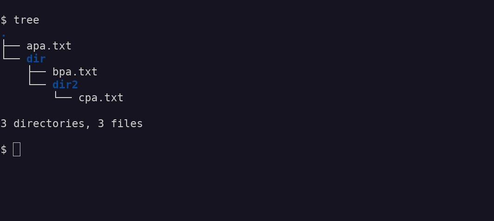{width=90%}

---

# git workflow (practical starts here)

```
$ git init
```

&nbsp;

\centering
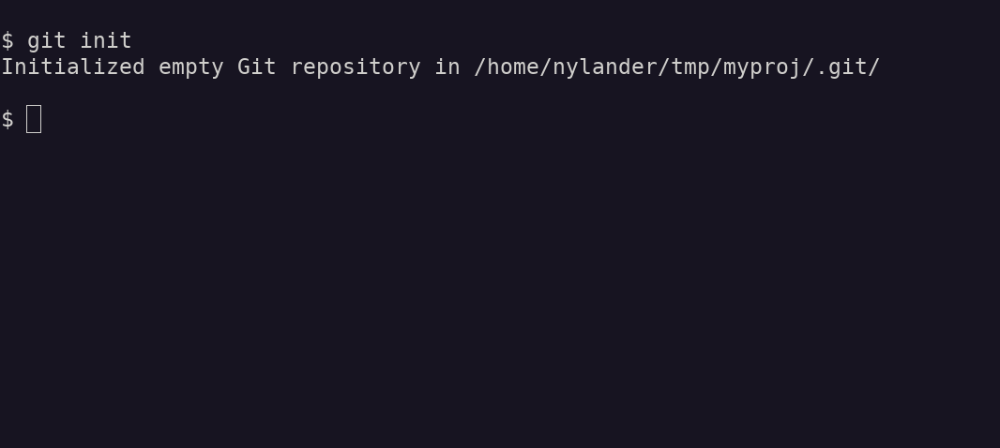{width=90%}

---

# git workflow

```
$ ls -a
```

&nbsp;

\centering
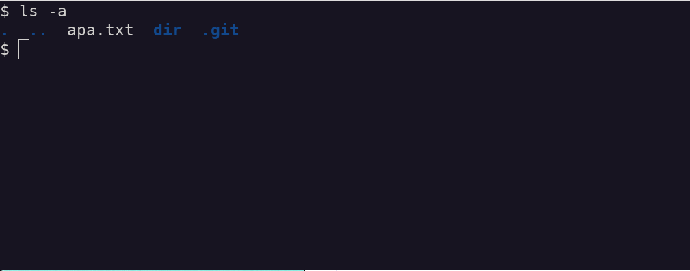{width=80%}

---

# git workflow

```
$ ls .git
```

&nbsp;

\centering
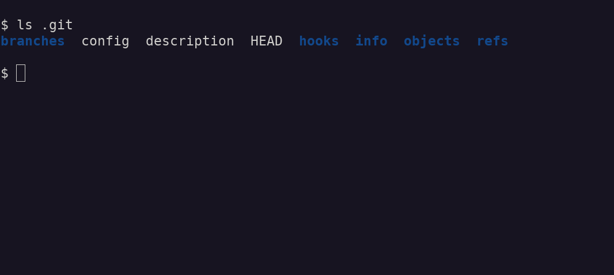{width=90%}

---

# git workflow

```
$ git status
```

&nbsp;

\centering
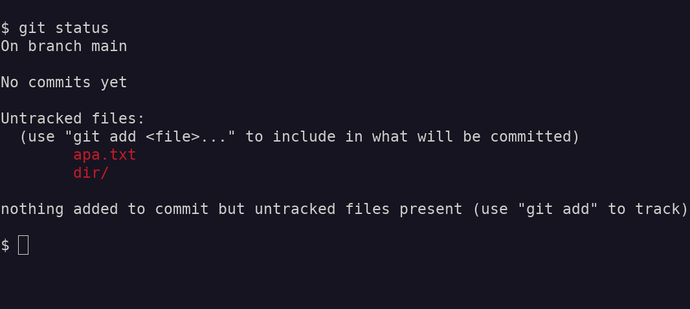{width=90%}

---

# git workflow

```
$ git add apa.txt dir/
```

---

# git workflow

```
$ git status
```

&nbsp;

\centering
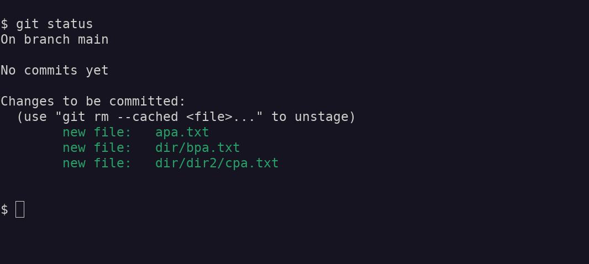{width=90%}

---

# git workflow

```
$ git commit -m "first commit"
```

&nbsp;

\centering
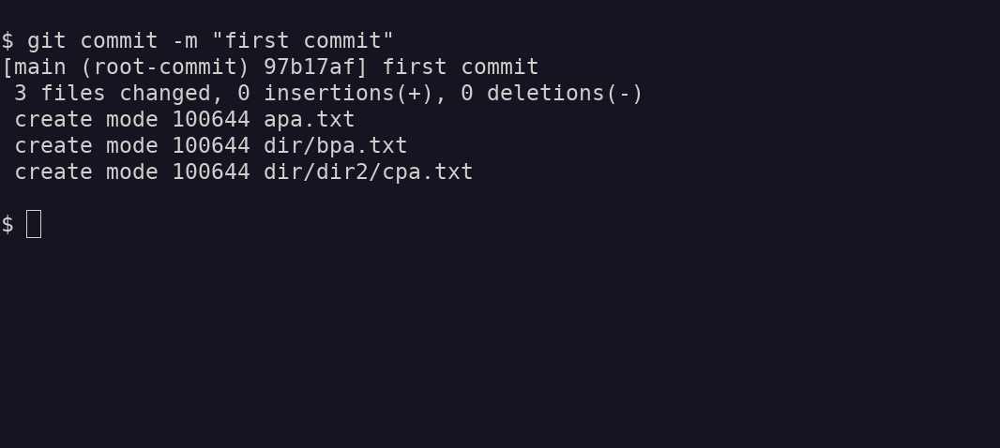{width=90%}

---

# git workflow

```
$ git status
```

&nbsp;

\centering
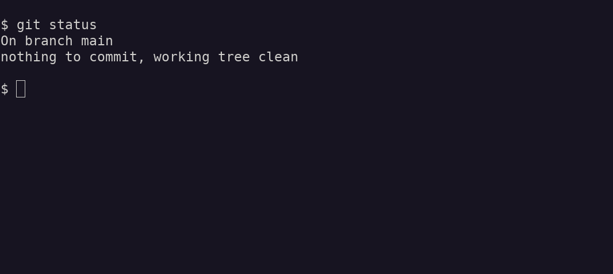{width=90%}

---

# git workflow

Add a README.md file[^2] in [markdown
format](https://docs.github.com/en/get-started/writing-on-github/getting-started-with-writing-and-formatting-on-github/basic-writing-and-formatting-syntax)
to your project

&nbsp;

```txt
# README for myproj

- 2018-04-01
- Joe.Bro@flo.co

## Description

Some description
```

[^2]: Can be copied from `git-github-intro/examples/download/README.md`

---

# git workflow

```
$ git status
```

&nbsp;

\centering
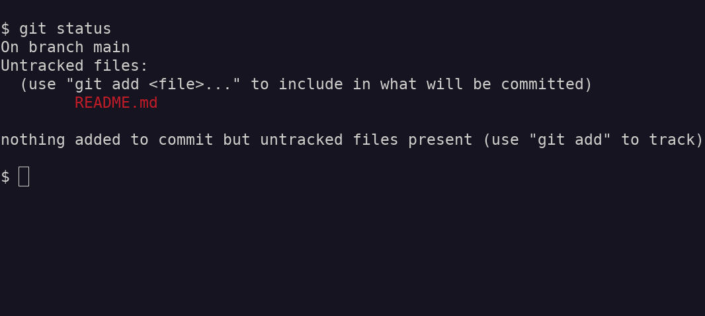{width=90%}

---

# git workflow

```
$ git add README.md
$ git commit -m "added README.md"
```

---

# git workflow

Edit a file (`apa.txt`)

&nbsp;

\centering
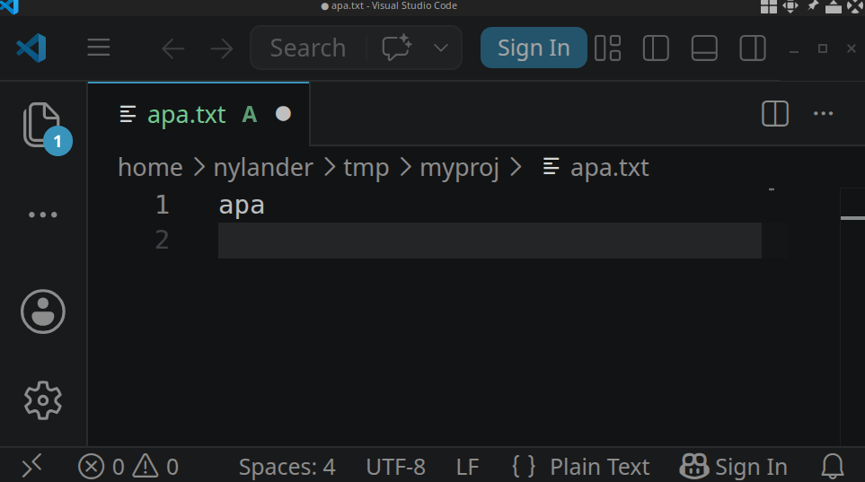{width=60%}


---

# git workflow

```
$ git status
```

&nbsp;

\centering
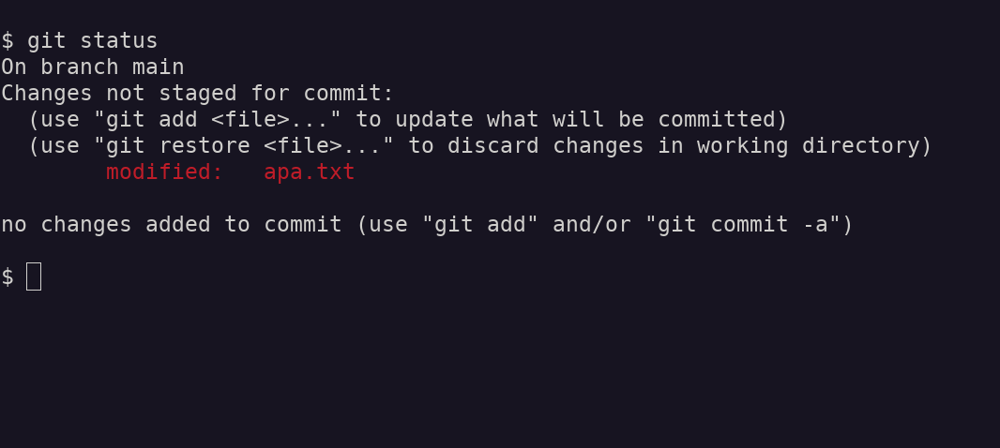{width=90%}

---

# git workflow

```
$ git add apa.txt
$ git commit -m "edited apa.txt"
```

---

# git workflow - Summary

```
$ git init
$ git add <files-and-folders>
$ git commit -m "message"
```

---

# Create a myproj repository on github

1. Open your private github page (`https://github.com/your-user-name`)

2. Click on the "`plus sign -> Create new... -> New repository`" (upper right-hand corner)

3. Add "`myproj`" as Repository name

4. Add a brief Description

5. Choose visiblity "`Private`"

6. Click on green button `Create repository`

---

# Add your local repository to github

```
$ cd myproj
$ git remote add origin https://github.com/your-user-name/myproj.git
$ git remote -v
$ git branch -M main
$ git push -u origin main
```

---

# Keep in sync with github!

**Before you start to work, always check that you are updated!**

&nbsp;

```
$ git status
$ git fetch
$ git status
$ git pull
```

---

# Visit your myproj repository on github

1. Edit some file by using the online editor (look for a pen symbol)

2. Save the changes (this will automatically do `git add` and prompt for a `commit`-message)

3. Go back you your local myproj repository and do

```
$ git status
$ git fetch
$ git status
$ git pull

```

---

# Work locally, then push to github

```
$ git add <files-and-folders-that-are-new-or-edited>
$ git commit -m "commit message"
$ git push
```

---

# So many commands...

\centering
{height=80%}

---

# Branches

\centering
{height=80%}

---

# git branch

```
$ git branch
```

&nbsp;

\centering
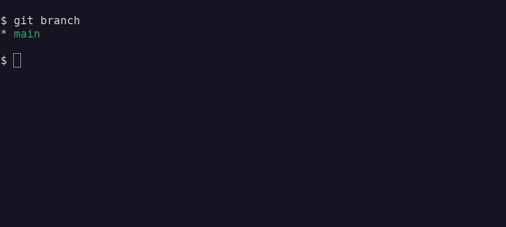{width=90%}

---

# git branch

```
$ git branch myfeature
$ git branch
```

&nbsp;

\centering
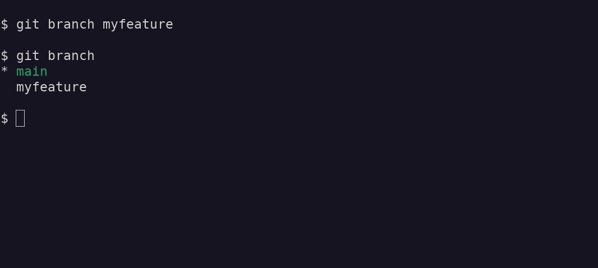{width=90%}

---

# git branch

```
$ git checkout myfeature
```

&nbsp;

\centering
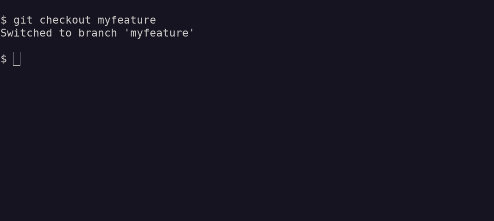{width=90%}

---

# git branch

```
$ git rm apa.txt
$ ls
```

&nbsp;

\centering
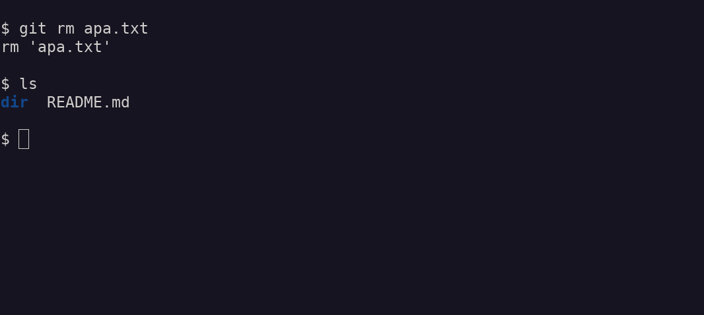{width=90%}

---

# git branch

Create a file (`bar`) with some content ("foo")[^3]

&nbsp;

\centering
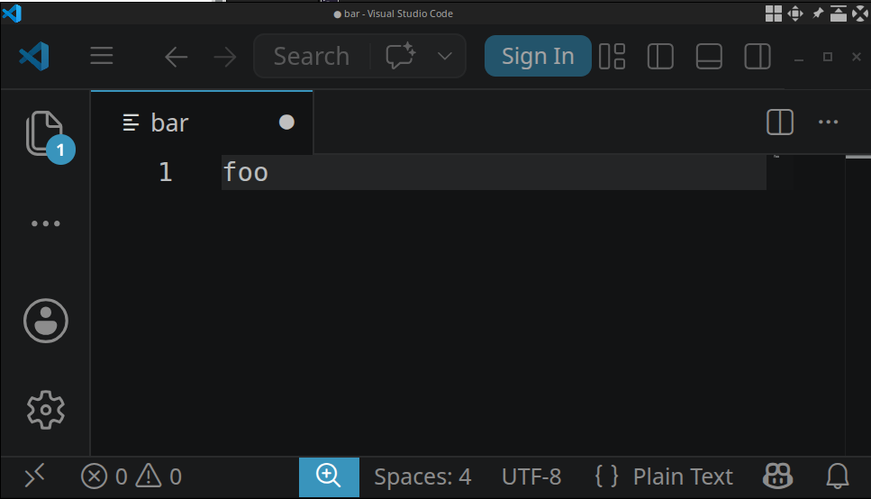{width=60%}

&nbsp;

[^3]: `$ echo "foo" > bar`

---

# git branch

```
$ git status
```

&nbsp;

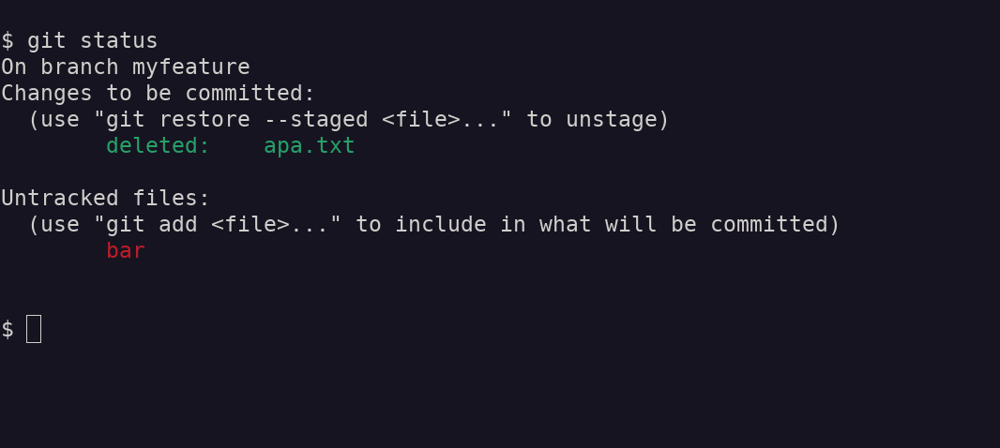{width=90%}

---

# git branch

```
$ git add bar
$ git commit -m "first commits on branch myfeature"
```

&nbsp;

\centering
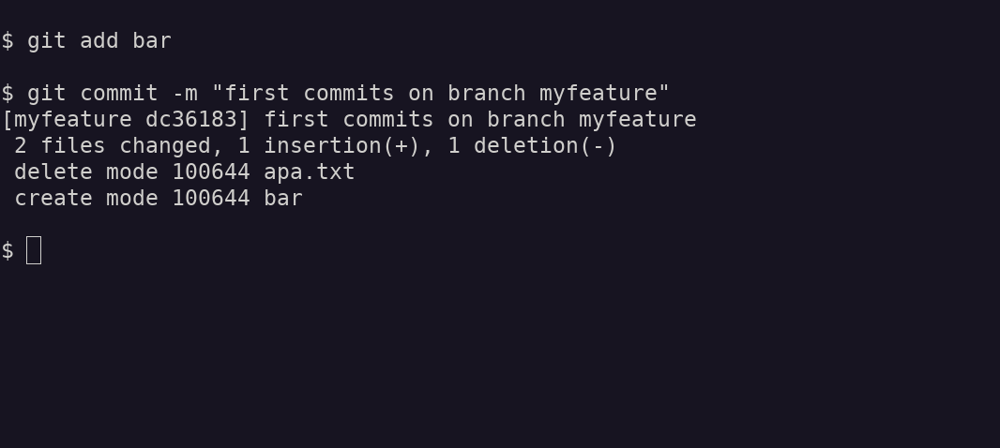{width=90%}

---

# git branch

```
$ ls
```

&nbsp;

\centering
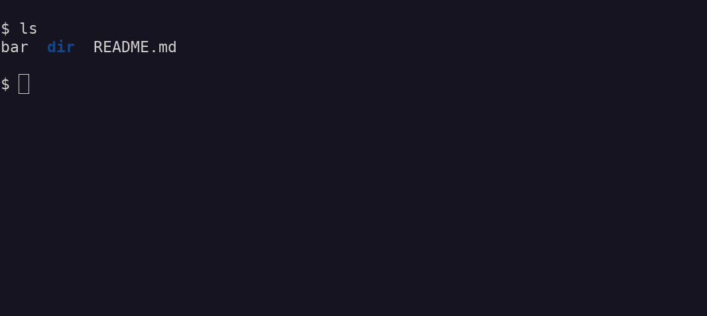{width=90%}

---

# git branch

```
$ git checkout main
```

&nbsp;

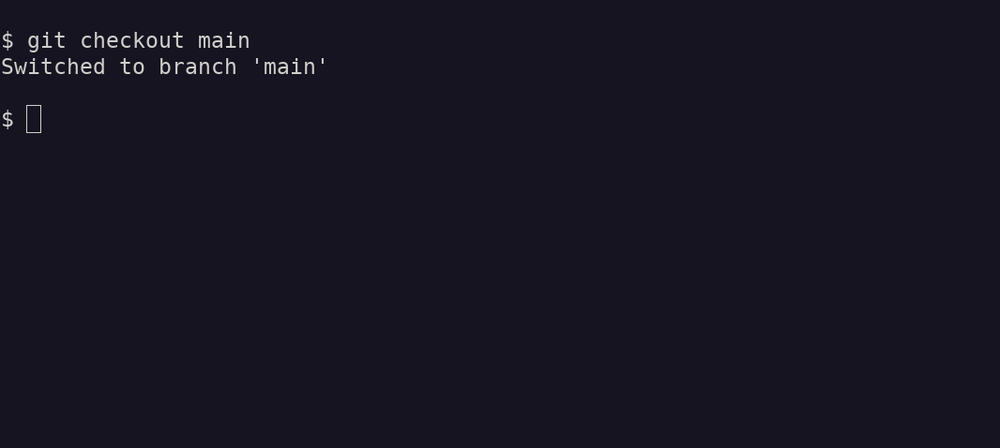{width=90%}

---

# git branch

```
$ ls
```

&nbsp;

\centering
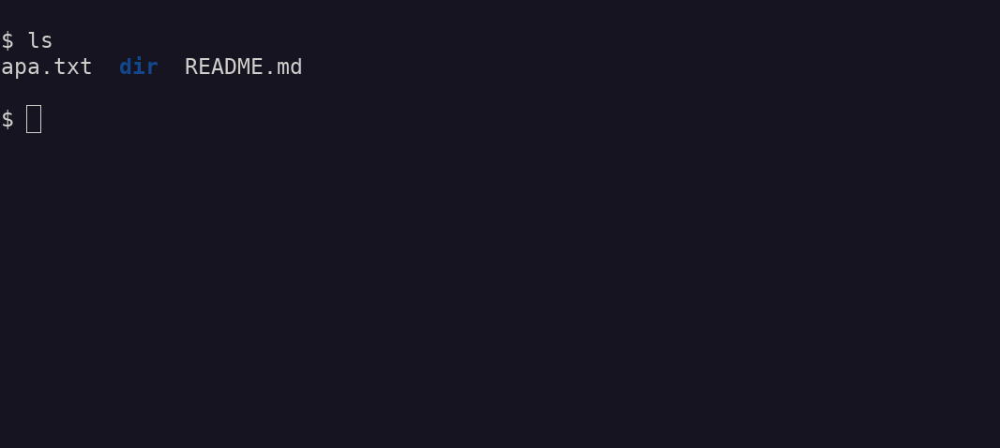{width=90%}

---

# Github branching workflow

\centering
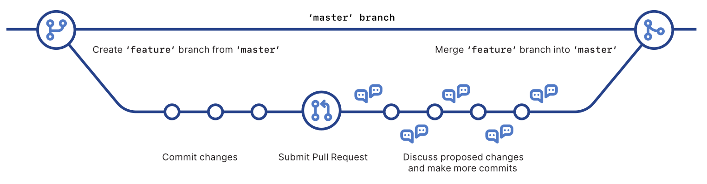{width=90%}

---

# Complications when branching

\Large
Since we created branch **banana**, our **main** have diverged!

&nbsp;

\centering
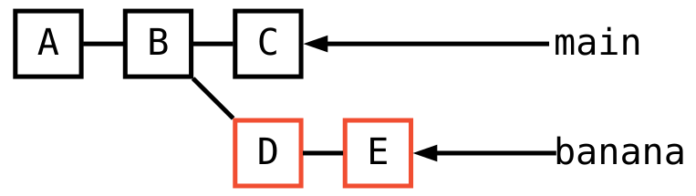{width=70%}

---

# git branch-edit-testmerge-merge workflow[^4]

```
$ git checkout -b myfix
$ sed -i 's/p/bb/' apa.txt
$ git add apa.txt
$ git commit -m "apa to abba"
$ git checkout main
$ git checkout -b mymergetest
$ git merge myfix # Check if all is OK
$ git checkout main
$ git merge myfix
$ git branch -d mymergetest
$ git branch -d myfix
```

[^4]: See separate exercise ["merge-conflicts"](https://github.com/Naturhistoriska/git-github-intro/tree/main/merge-conflicts)

---

# git "undo"

Add some content to `apa.txt`

\centering
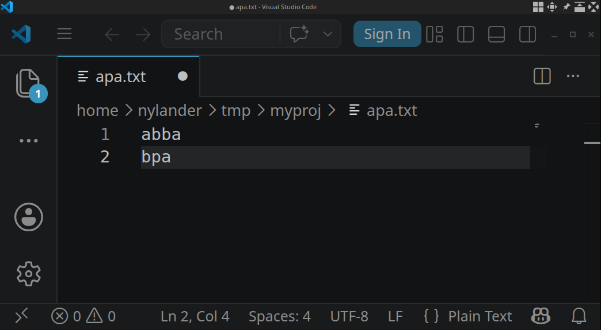{width=60%}

---

# git "undo"

Assume we wish to undo changes to file `apa.txt`, but

1. Have we saved the file?

2. Have we staged the file?

3. Have we made a commit?

4. Have we made several commits?

5. Do we wish to go back to an even older version?

---

# git "undo"

Brute force (quick and simple)

&nbsp;

- Edit the file again (then `add` + `commit`)

---

# git "undo"

After staging (but before commit): [`restore`](https://git-scm.com/docs/git-restore)

&nbsp;

```
$ git restore --staged apa.txt
```

---

# git undo

After commit: [`restore`](https://git-scm.com/docs/git-restore),
[`reset`](https://git-scm.com/docs/git-reset), or
[`checkout`](https://git-scm.com/docs/git-checkout). Use
[`log`](https://git-scm.com/docs/git-log) to locate commits back in history.

&nbsp;

```
$ git checkout <commit id> -- apa.txt
```

---

# git undo

- <https://docs.gitlab.com/topics/git/undo/>

- <https://blog.github.com/2015-06-08-how-to-undo-almost-anything-with-git/>

---

# Try the merge-conflicts exercise?

- <https://github.com/Naturhistoriska/git-github-intro/tree/main/merge-conflicts>

